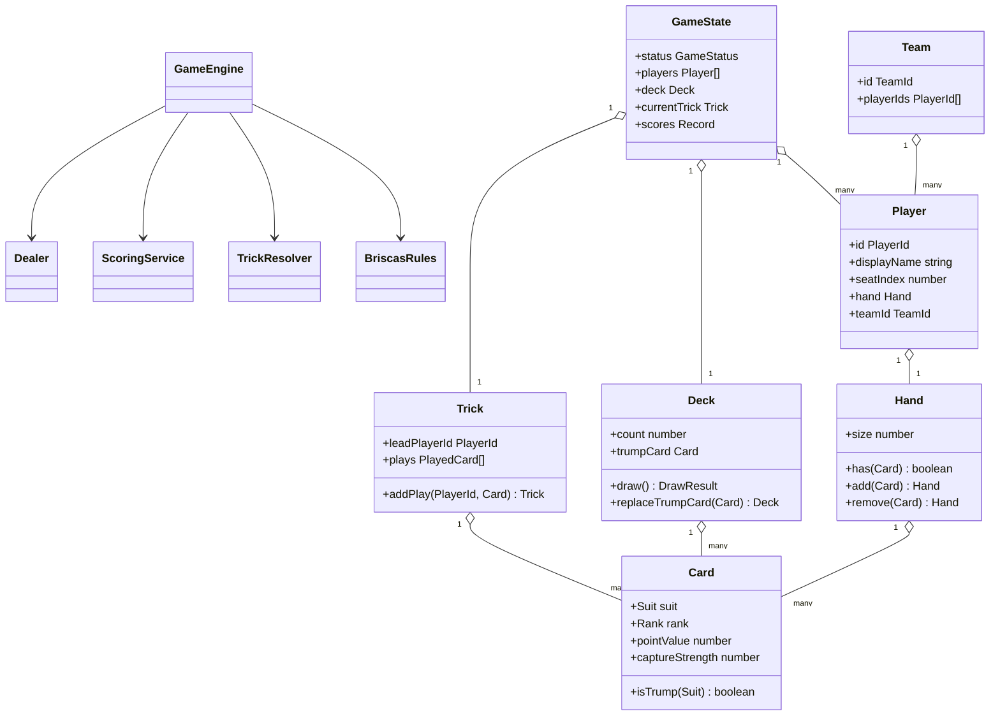
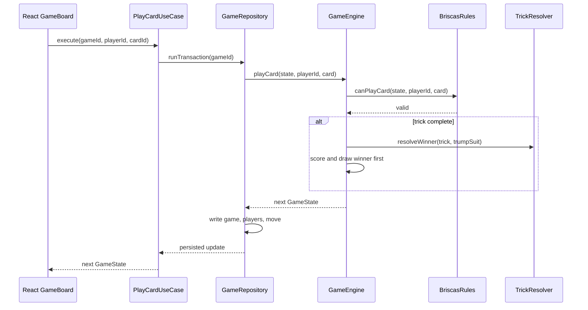
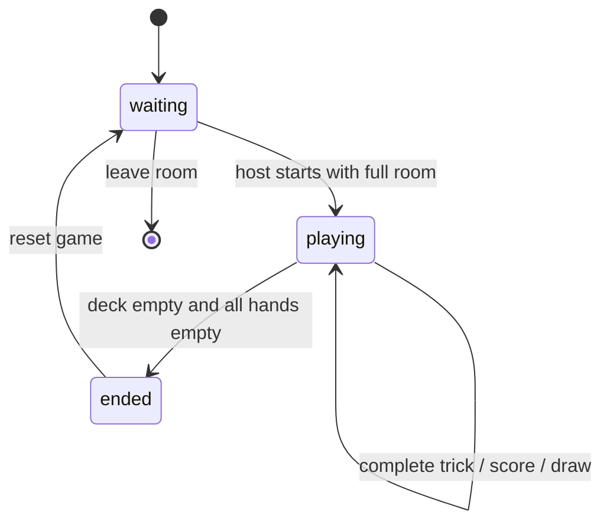
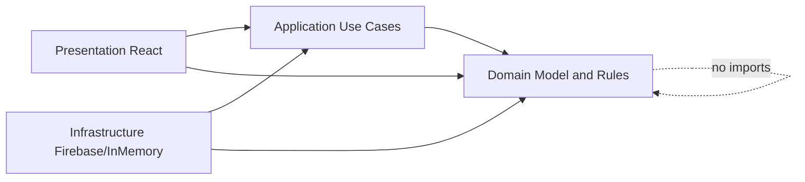
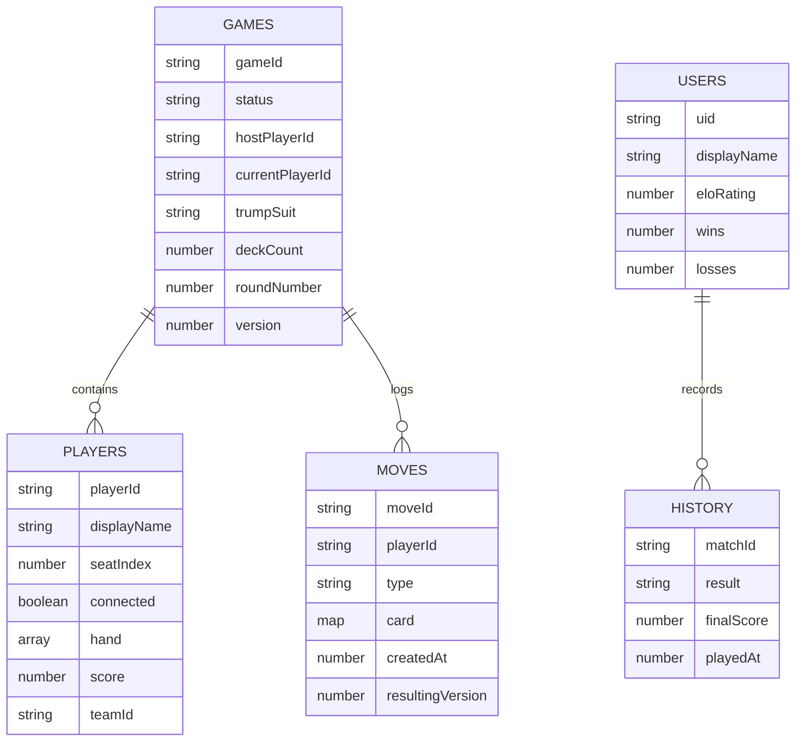

# UML Diagrams

## Domain Class Diagram



## Player Plays A Card



## Create Join Start

```mermaid
sequenceDiagram
  participant Host
  participant Create as CreateGameUseCase
  participant Join as JoinGameUseCase
  participant Start as StartGameUseCase
  participant Repo as GameRepository
  participant Engine as GameEngine
  Host->>Create: create room
  Create->>Engine: createGame()
  Create->>Repo: createGame(snapshot)
  participant Guest
  Guest->>Join: join room code
  Join->>Repo: runTransaction()
  Repo->>Engine: joinGame()
  Host->>Start: start
  Start->>Repo: runTransaction()
  Repo->>Engine: startGame(seed)
  Engine->>Engine: deal 3, reveal trump
```

## Game Lifecycle



## Component Dependencies



## Firestore Data Model


